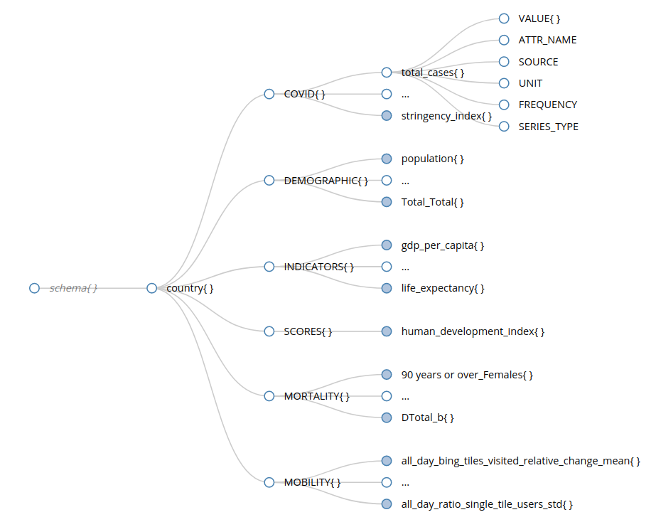

# Data model description

After fetching data from sources, these are integrated and harmonized in a single data model. This document describes 
its structure.

This single dataset loaded using *FAIRiskDataset* load method is composed by a dictionary. This dictionary is 
accessible using the get method of the class and has the following structure: 
*Country > Category > Attribute > Value&Metadata*.

<figure>
  
  <figcaption>Data model diagram</figcaption>
</figure>


### Countries
The country key is the name of country. All countries are converted to a standard short name using 
[Country Converter](https://github.com/konstantinstadler/country_converter) Python package. The number of countries 
available may change depending on the selected source datasets.


### Categories
The categories availability depends on the selected datasets when creating FAIRiskDataset. Default (fetch 
data from all supported sources) categories are:
- COVID
- DEMOGRAPHIC
- INDICATORS
- SCORES
- MORTALITY
- MOBILITY

Checkout which data sources contribute for each category [here](../docs/SourceDatasets.md).


### Attributes
Each category has a specific list of attributes. Each attribute contains the following information:
- VALUE - A dictionary containing the attribute value(s), where keys correspond to a time frame (e.g. year, week, day)
- ATTR_NAME - The attribute name/description
- SOURCE - The source dataset of the attribute
- UNIT - The unit type of the values
- FREQUENCY - Frequency of time-series values, if applicable (DAILY, WEEKLY, MONTHLY, YEARLY)
- SERIES_TYPE - Defines the type of time-series data as NEW (each entry represents a number read during each period, 
e.g. daily number of new COVID-19 cases per country), TOTAL (corresponds to cumulative time-series, where each entry 
represents a total count a each period, e.g. total number of COVID-19 cases per country), CURRENT (each entry consists 
in a value which is updated over time, e.g. stringency index)


### Export data

The *FAIRiskDataset* class also provides a method to export data as a *pandas.DataFrame*. This method can be invoked to 
export all data available in the JSON file or the remaining data after data query and transformations.  
Three types of export are available for convenience: only time-series data, only non time-series data, all data.


#### Generating the current JSON Schema from local JSON file
A function is provided to generate the JSON Schema of the hierarchy of the current local version of the data.
You can generate it by running the following line:

```bash
python ./fairiskdata/utils/fairisk_dataset_json_schema_creator.py
```

The output file will be available at *output/fairisk_dataset.schema.json*.
